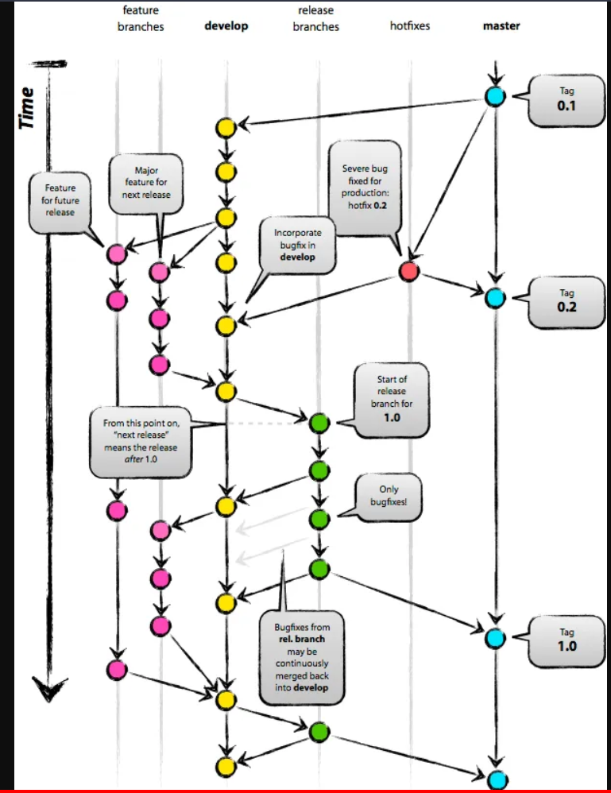

## REPOSITORIO ESPECIAL EN GITHUB CON USERNAME

Si en Github creamos un repositorio con el mismo nombre que nuestro username es un repositorio especial donde añadir un README que aparecerá

username: alansastre

repositorio: alansastre

##  BORRAR REPOSITORIO

En settings, hacer scroll hacia abajo del todo, en Danger zone permite borrar.

## MOSTRAR IMAGENES EN MARKDOWN

Pegar una imagen en la carpeta de nuestro proyecto.

Desde un archivo md podemos mostrarla escribiendo esta sintaxis:

## GIT FLOW

Modelo sencillo:

* main --> --> --> --> --> --> --> 
* alan --> --> --> --> 
* carlos --> --> --> 

Modelo Git Flow:

* main --> 1.0.0 --> 1.1.0
* develop
* alan
* carlos

1. Instalar extensión gitflow OK
2. Cerrar y volver a abrir Visual Studio Code OK
3. Crear nuevo proyecto con GitHub Desktop OK
4. Open in visual studio code OK
3. Ctrl + Shift + P: Gitflow Initialize repository for gitflow
    * main
    * develop
    * bugfix/
    * feature/
    * release/
    * hotfix/
    * support

4. Esto crea ramas y nos coloca en develop
5. Crear una feature para hacer un nuevo desarrollo
    * Ctrl + Shift + P : GitFlow Feature Start
    * Hacer commits y push
    * Ctrl + Shift + P: GitFlow Feature Finish

## SOLUCION PROBLEMAS GITFLOW

Si sale un cuadro rojo entonces:

Ctrl + Shift + P: Gitflow Feature start te saca un panel que dice Enable now

Entonces comienza automaticamente a inicializar: main, develop, bugfix...

## PROCESO COMPLETO DE DESARROLLO 

### FEATURES

develop --> feature/desarrollo1 

Para introducir nuevos desarrollos en develop:

1. Gitflow feature start: crea una nueva rama por ejemplo feature/product-list
2. nuevos cambios, commit y push
3. Gitflow feature finish: fusiona la rama feature en develop y cierra la rama feature automáticamente.

### RELEASES

develop --> release/v1.0.0 --> main

Para mover los desarrollos de develop a main:

1. Gitflow release start: crea nueva rama por ejemplo release/v1.0.0
2. nuevos cambios , commit y push
3. Gitflow release finish: fusiona la rama release en main y develop y la cierra